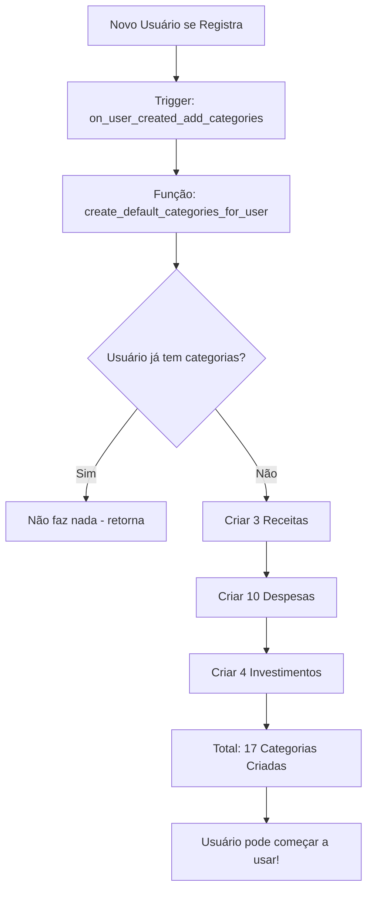

# Sistema de Categorias Padrão

## Visão Geral

Quando um novo usuário se registra no sistema, **17 categorias essenciais** são criadas automaticamente para ele, organizadas por tipo:

- ✅ **3 Categorias de Receitas**
- ✅ **10 Categorias de Despesas**
- ✅ **4 Categorias de Investimentos**

Isso garante que o usuário já possa começar a usar o sistema imediatamente, sem precisar criar categorias manualmente.

## Como Funciona

### Para Novos Usuários

Quando um novo usuário é criado:
1. Um **trigger** é ativado automaticamente
2. A função `create_default_categories_for_user()` é executada
3. As 17 categorias são criadas e vinculadas ao usuário
4. O usuário já vê suas categorias na tela de Categorias

### Para Usuários Existentes

Se você já tem usuários no sistema que foram criados ANTES desta migration:
1. Execute o script `apply_default_categories_existing_users.sql`
2. Ele identifica usuários sem categorias
3. Cria as categorias padrão para eles

## Categorias Criadas Automaticamente

### 📈 RECEITAS (3)

| Nome | Cor | Ícone |
|------|-----|-------|
| Salário | Verde (#10b981) | Wallet |
| Freelance | Azul (#3b82f6) | Briefcase |
| Outros Ganhos | Roxo (#8b5cf6) | Gift |

### 📉 DESPESAS (10)

#### Essenciais
| Nome | Cor | Ícone |
|------|-----|-------|
| Alimentação | Verde (#10b981) | Utensils |
| Moradia | Azul (#3b82f6) | Home |
| Transporte | Vermelho (#ef4444) | Car |
| Saúde | Laranja (#f59e0b) | Heart |

#### Pessoais
| Nome | Cor | Ícone |
|------|-----|-------|
| Educação | Roxo (#8b5cf6) | GraduationCap |
| Lazer | Pink (#ec4899) | Gamepad2 |
| Vestuário | Cyan (#06b6d4) | Shirt |

#### Recorrentes
| Nome | Cor | Ícone |
|------|-----|-------|
| Assinaturas | Indigo (#6366f1) | Smartphone |
| Contas | Lime (#84cc16) | Zap |

#### Outros
| Nome | Cor | Ícone |
|------|-----|-------|
| Outros Gastos | Cinza (#64748b) | Tag |

### 💰 INVESTIMENTOS (4)

| Nome | Cor | Ícone |
|------|-----|-------|
| Poupança | Verde (#22c55e) | PiggyBank |
| Ações | Vermelho (#ef4444) | LineChart |
| Renda Fixa | Azul (#3b82f6) | BadgeDollarSign |
| Outros Investimentos | Roxo (#8b5cf6) | BarChart3 |

## Como Aplicar

### 1. Para Novos Usuários (Automático)

Execute a migration no Supabase SQL Editor:

```bash
supabase/migrations/013_auto_create_default_categories.sql
```

Isso cria:
- ✅ Função `create_default_categories_for_user()`
- ✅ Trigger `on_user_created_add_categories`
- ✅ Função manual `create_default_categories_for_user_manual()`

A partir de agora, TODOS os novos usuários receberão as categorias automaticamente!

### 2. Para Usuários Existentes (Manual)

Se você já tem usuários sem categorias, execute:

```bash
database/scripts/apply_default_categories_existing_users.sql
```

Ou execute manualmente para um usuário específico:

```sql
-- Para o usuário atual logado
SELECT public.create_default_categories_for_user_manual(auth.uid());

-- Para um usuário específico (substitua o UUID)
SELECT public.create_default_categories_for_user_manual('uuid-do-usuario-aqui');
```

## Verificação

### Ver Usuários Sem Categorias

```sql
SELECT
  u.id,
  u.email,
  u.name,
  COUNT(c.id) as total_categorias
FROM public.users u
LEFT JOIN public.categories c ON u.id = c.user_id
GROUP BY u.id, u.email, u.name
HAVING COUNT(c.id) = 0;
```

### Ver Categorias de um Usuário

```sql
SELECT
  c.name,
  tt.name as tipo,
  c.color,
  i.name as icone
FROM public.categories c
LEFT JOIN public.transaction_types tt ON c.transaction_type_id = tt.id
LEFT JOIN public.icons i ON c.icon_id = i.id
WHERE c.user_id = auth.uid()
ORDER BY c.transaction_type_id, c.name;
```

### Verificar o Trigger

```sql
SELECT
  trigger_name,
  event_manipulation,
  event_object_table
FROM information_schema.triggers
WHERE trigger_name = 'on_user_created_add_categories';
```

## Customização

### O Usuário Pode Editar?

✅ **SIM!** O usuário pode:
- Editar o nome, cor e ícone das categorias
- Deletar categorias que não usa
- Criar novas categorias personalizadas

As categorias padrão são apenas um **ponto de partida**. O usuário tem controle total.

### Alterar as Categorias Padrão

Se você quiser mudar quais categorias são criadas por padrão:

1. Edite a migration `013_auto_create_default_categories.sql`
2. Modifique as linhas de `INSERT INTO public.categories`
3. Execute a migration novamente (ou recrie a função)

Exemplo - Adicionar categoria "Pets":

```sql
INSERT INTO public.categories (user_id, name, color, icon_id, transaction_type_id)
VALUES
  (NEW.id, 'Pets', '#f97316', 70, 2);  -- Dog icon
```

## Diferença: Categorias do Sistema vs Categorias do Usuário

### Categorias do Sistema (`user_id = NULL`)
- Criadas na migration `007_seed_data.sql`
- Visíveis para TODOS os usuários (devido ao RLS)
- Usuário NÃO pode editar ou deletar
- Servem como "fallback" quando o usuário não tem categorias próprias

### Categorias do Usuário (`user_id = UUID`)
- Criadas automaticamente ao registrar
- Visíveis APENAS para o dono
- Usuário PODE editar e deletar
- Personalizáveis

## Segurança

### RLS (Row Level Security)

As políticas de RLS garantem que:
- Cada usuário só vê suas próprias categorias
- Todos podem ver categorias do sistema (`user_id IS NULL`)
- Usuário só pode editar/deletar suas próprias categorias

### Funções SECURITY DEFINER

As funções usam `SECURITY DEFINER` com `SET search_path = public` para:
- Evitar path injection
- Garantir que a função execute com as permissões corretas
- Manter segurança mesmo sendo trigger automático

## Fluxo Completo



## Troubleshooting

### Categorias não foram criadas para novo usuário

1. Verificar se o trigger existe:
```sql
SELECT * FROM information_schema.triggers
WHERE trigger_name = 'on_user_created_add_categories';
```

2. Verificar se a função existe:
```sql
SELECT routine_name FROM information_schema.routines
WHERE routine_name = 'create_default_categories_for_user';
```

3. Criar manualmente:
```sql
SELECT public.create_default_categories_for_user_manual(auth.uid());
```

### Categorias duplicadas

O sistema verifica se o usuário já tem categorias antes de criar. Se ainda assim duplicou:

```sql
-- Deletar categorias duplicadas (mantém a primeira)
DELETE FROM public.categories c1
WHERE c1.user_id = auth.uid()
  AND EXISTS (
    SELECT 1 FROM public.categories c2
    WHERE c2.user_id = c1.user_id
      AND c2.name = c1.name
      AND c2.id < c1.id
  );
```

## Arquivos Relacionados

- `supabase/migrations/013_auto_create_default_categories.sql` - Migration principal
- `database/scripts/apply_default_categories_existing_users.sql` - Script para usuários existentes
- `database/scripts/README_CATEGORIAS_PADRAO.md` - Este arquivo

## Histórico de Mudanças

- **Migration 009**: Primeira tentativa (categorias do sistema copiadas)
- **Migration 012**: Removida criação automática (a pedido do usuário)
- **Migration 013**: Nova implementação (categorias personalizadas do usuário)
