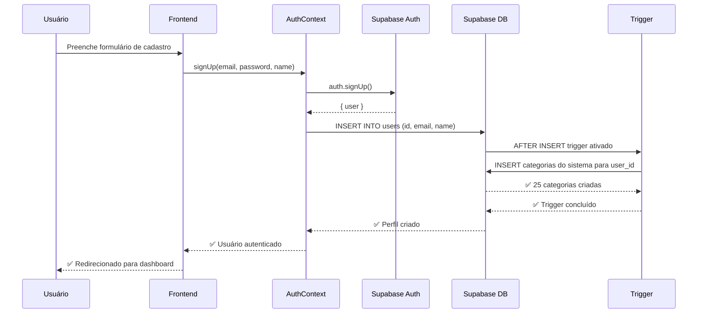

# Auto-atribuição de Categorias Padrão para Novos Usuários

## 📋 Visão Geral

Esta funcionalidade garante que **todo novo usuário** que se cadastrar no sistema já receba automaticamente **todas as categorias padrão** do sistema, facilitando a experiência inicial e permitindo que o usuário comece a usar a aplicação imediatamente.

## 🎯 Problema Resolvido

Antes, quando um novo usuário se cadastrava:
- ❌ Não tinha nenhuma categoria disponível
- ❌ Precisava criar manualmente todas as categorias
- ❌ Experiência inicial ruim

Agora, com o trigger automático:
- ✅ Recebe automaticamente 25 categorias padrão
- ✅ Pode começar a usar o sistema imediatamente
- ✅ Pode personalizar/editar as categorias depois
- ✅ Pode criar novas categorias customizadas

## 🔧 Como Funciona

### 1. Categorias do Sistema

As categorias padrão ficam armazenadas na tabela `categories` com `user_id = NULL`, indicando que são categorias do sistema.

Exemplo de categorias padrão:
- **Receitas**: Salário, Freelance, Investimentos, Reembolsos
- **Despesas**: Moradia, Transporte, Alimentação, Saúde, Educação, Lazer, etc.
- **Aportes**: Poupança, Ações, Fundos, Criptomoedas, CDB, Tesouro Direto, FGTS

### 2. Trigger Automático

Quando um novo usuário é criado na tabela `users`:
1. O trigger `assign_categories_on_user_creation` é ativado automaticamente
2. A função `assign_default_categories_to_user()` é executada
3. Todas as categorias do sistema são **copiadas** para o novo usuário
4. O usuário recebe suas próprias categorias (com `user_id` = ID do usuário)

### 3. Arquitetura

```
┌─────────────────────────────────────────────────────────────┐
│  Novo usuário se cadastra (Supabase Auth)                  │
└────────────────────┬────────────────────────────────────────┘
                     │
                     ▼
┌─────────────────────────────────────────────────────────────┐
│  AuthContext cria registro na tabela "users"                │
└────────────────────┬────────────────────────────────────────┘
                     │
                     ▼
┌─────────────────────────────────────────────────────────────┐
│  🚀 TRIGGER AUTOMÁTICO                                      │
│  assign_categories_on_user_creation                         │
└────────────────────┬────────────────────────────────────────┘
                     │
                     ▼
┌─────────────────────────────────────────────────────────────┐
│  Função: assign_default_categories_to_user()                │
│                                                             │
│  SELECT categorias WHERE user_id IS NULL                   │
│  INSERT INTO categories (cópia para o novo usuário)        │
└────────────────────┬────────────────────────────────────────┘
                     │
                     ▼
┌─────────────────────────────────────────────────────────────┐
│  ✅ Usuário agora tem suas próprias categorias!             │
└─────────────────────────────────────────────────────────────┘
```

## 📦 Arquivos Criados/Modificados

### 1. Migration SQL
- **Arquivo**: `supabase/migrations/009_auto_assign_default_categories.sql`
- **Conteúdo**:
  - Função `assign_default_categories_to_user()`
  - Trigger `assign_categories_on_user_creation`

### 2. Script de Aplicação
- **Arquivo**: `scripts/apply-auto-categories-migration.js`
- **Uso**: Aplica a migration automaticamente

### 3. Documentação
- **Arquivo**: `docs/AUTO_ASSIGN_CATEGORIES.md` (este arquivo)

## 🚀 Como Aplicar a Migration

Você tem **duas opções** para aplicar esta migration:

### Opção 1: Script Automático (Recomendado se tiver acesso via API)

```bash
node scripts/apply-auto-categories-migration.js
```

### Opção 2: SQL Editor do Supabase (Mais Confiável)

1. Acesse o **Supabase Dashboard**
2. Vá em **SQL Editor** (ícone de banco de dados na lateral)
3. Clique em **New Query**
4. Copie todo o conteúdo do arquivo:
   ```
   supabase/migrations/009_auto_assign_default_categories.sql
   ```
5. Cole no editor e clique em **Run**
6. Aguarde a confirmação ✅

**URL do SQL Editor**:
```
https://supabase.com/dashboard/project/[SEU_PROJECT_ID]/sql/new
```

## ✅ Verificação

Para verificar se o trigger está funcionando:

### 1. Verificar no SQL Editor

Execute este SQL no Supabase SQL Editor:

```sql
-- Verificar se a função existe
SELECT
  routine_name,
  routine_type
FROM information_schema.routines
WHERE routine_name = 'assign_default_categories_to_user';

-- Verificar se o trigger existe
SELECT
  trigger_name,
  event_manipulation,
  event_object_table
FROM information_schema.triggers
WHERE trigger_name = 'assign_categories_on_user_creation';
```

Resultado esperado:
- 1 linha com a função `assign_default_categories_to_user`
- 1 linha com o trigger `assign_categories_on_user_creation`

### 2. Testar Criando um Novo Usuário

1. **Cadastre um novo usuário** pela interface de login
2. Após o cadastro, execute no SQL Editor:

```sql
-- Verificar categorias do novo usuário
-- Substitua 'email@usuario.com' pelo email do usuário que você cadastrou
SELECT
  c.id,
  c.name,
  c.color,
  c.transaction_type_id,
  c.user_id,
  u.email
FROM categories c
JOIN users u ON u.id = c.user_id
WHERE u.email = 'email@usuario.com';
```

**Resultado esperado**: ~25 categorias com o `user_id` do novo usuário

## 🎨 Categorias Padrão Incluídas

| ID  | Nome              | Tipo         | Ícone ID | Cor       |
|-----|-------------------|--------------|----------|-----------|
| 1   | Salário          | Receita (1)  | 1        | #10b981   |
| 2   | Freelance        | Receita (1)  | 41       | #3b82f6   |
| 3   | Investimentos    | Receita (1)  | 8        | #8b5cf6   |
| 4   | Reembolsos       | Receita (1)  | 10       | #f59e0b   |
| 5   | Moradia          | Despesa (2)  | 11       | #3b82f6   |
| 6   | Transporte       | Despesa (2)  | 17       | #ef4444   |
| 7   | Alimentação      | Despesa (2)  | 25       | #10b981   |
| 8   | Saúde            | Despesa (2)  | 32       | #f59e0b   |
| 9   | Educação         | Despesa (2)  | 39       | #8b5cf6   |
| 10  | Lazer            | Despesa (2)  | 48       | #ec4899   |
| 11  | Assinaturas      | Despesa (2)  | 67       | #06b6d4   |
| 12  | Família          | Despesa (2)  | 68       | #f97316   |
| 13  | Crédito          | Despesa (2)  | 4        | #6366f1   |
| 14  | Utilities        | Despesa (2)  | 63       | #84cc16   |
| 15  | Compras          | Despesa (2)  | 53       | #ec4899   |
| 16  | Serviços         | Despesa (2)  | 60       | #06b6d4   |
| 17  | Impostos         | Despesa (2)  | 73       | #f97316   |
| 18  | Poupança         | Aporte (3)   | 6        | #22c55e   |
| 19  | Ações            | Aporte (3)   | 77       | #ef4444   |
| 20  | Fundos           | Aporte (3)   | 78       | #8b5cf6   |
| 21  | Criptomoedas     | Aporte (3)   | 7        | #ec4899   |
| 22  | Outros           | Despesa (2)  | 84       | #64748b   |
| 23  | CDB              | Aporte (3)   | 76       | #3b82f6   |
| 24  | Tesouro Direto   | Aporte (3)   | 75       | #f59e0b   |
| 25  | FGTS             | Aporte (3)   | 83       | #10b981   |

## 🔒 Segurança (RLS)

As categorias do usuário são protegidas por **Row Level Security (RLS)**:

- ✅ Usuários podem **ver** suas próprias categorias
- ✅ Usuários podem **ver** categorias do sistema (user_id = NULL)
- ✅ Usuários podem **criar** novas categorias
- ✅ Usuários podem **editar** suas próprias categorias
- ✅ Usuários podem **deletar** (soft delete) suas próprias categorias
- ❌ Usuários **NÃO** podem ver/editar categorias de outros usuários

## 🔄 Fluxo Completo



## 💡 Benefícios

1. **Experiência do Usuário**
   - Onboarding mais rápido
   - Usuário pode usar o sistema imediatamente
   - Menos fricção no cadastro

2. **Manutenibilidade**
   - Categorias padrão gerenciadas em um só lugar
   - Fácil adicionar/modificar categorias padrão
   - Trigger garante consistência

3. **Flexibilidade**
   - Usuário pode editar as categorias recebidas
   - Usuário pode criar novas categorias
   - Usuário pode deletar categorias que não usa

## ⚠️ Notas Importantes

1. **Categorias Existentes**: Usuários que já existiam antes da aplicação do trigger **não** receberão as categorias automaticamente. Se necessário, execute um script de migração para esses usuários.

2. **Modificar Categorias Padrão**: Para modificar as categorias padrão, edite o arquivo:
   ```
   supabase/migrations/007_seed_data.sql
   ```
   E execute novamente a migration.

3. **Performance**: O trigger adiciona um pequeno overhead na criação de usuários (~25 INSERTs), mas isso é insignificante para o benefício oferecido.

## 🛠️ Troubleshooting

### O trigger não está funcionando

1. Verifique se a migration foi aplicada corretamente:
   ```sql
   SELECT * FROM information_schema.triggers
   WHERE trigger_name = 'assign_categories_on_user_creation';
   ```

2. Verifique se existem categorias do sistema:
   ```sql
   SELECT COUNT(*) FROM categories WHERE user_id IS NULL;
   ```

3. Veja os logs do trigger (se disponível no Supabase Dashboard)

### Usuário não recebeu categorias

1. Verifique se o perfil foi criado na tabela `users`:
   ```sql
   SELECT * FROM users WHERE email = 'email@usuario.com';
   ```

2. Verifique se o trigger está ativo:
   ```sql
   SELECT tgenabled FROM pg_trigger
   WHERE tgname = 'assign_categories_on_user_creation';
   ```
   (tgenabled deve ser 'O' para ativo)

### Erro ao aplicar migration

Se você encontrar erros ao aplicar a migration:
1. Verifique se você tem permissões suficientes
2. Use a Opção 2 (SQL Editor) ao invés do script
3. Execute os comandos SQL manualmente, um por vez

## 📚 Referências

- [Supabase Triggers](https://supabase.com/docs/guides/database/postgres/triggers)
- [PostgreSQL Triggers](https://www.postgresql.org/docs/current/sql-createtrigger.html)
- [Supabase Row Level Security](https://supabase.com/docs/guides/database/postgres/row-level-security)

---

**Autor**: Claude Code
**Data**: 2025-12-13
**Versão**: 1.0.0
